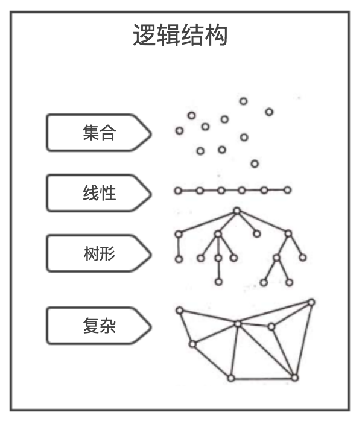

# 基本概念和术语
1. `数据`：是描述客观事物的符号，是计算机中可以操作的对象，是能被计算机识别，并输入给计算机处理的符号的集合。
   - 可以输入到计算机中
   - 能被计算机程序处理
2. `数据元素`：是组成数据的，有一定意义的基本单位，在计算机通常作为整体处理
3. `数据项`:一个数据元素可以由若干个数据项组成。数据项是数据不可分割的最小单位
4. `数据对象`：是性质相同的数据元素的集合，是数据的子集
5. `数据结构`：是相互之间存在一种或多种特定关系的数据元素的集合

# 逻辑结构和物理结构
## 1.逻辑结构
1. `集合结构`：集合结构中的数据元素除了属于同一集合外，它们之间没有其他关系。
2. `线性结构`：线性结构中的数据元素是**一对一**的关系
3. `树形结构`：树形结构中的数据元素之间**存在一种一对多**的层次关系
4. `图形结构`：图形结构中的数据元素是**多对多**的关系



## 2.物理结构
**物理结构：数据的逻辑结构在计算机中的存储形式**
1. `顺序存储结构`：是把数据元素放在地址连续的存储单元里，其数据间的逻辑关系和物理关系是一致的
2. `链式存储结构`:是把数据元素放在任意的存储单元里，这组存储单元可以是连续的，也可以是不连续的

# 抽象数据类型
1. `数据类型`：是指一组性质相同的值的集合及定义在此集合上的一些操作的总称
   - `原子类型`：是不可再分解的基本类型。例如：`int`,`float`,`char`
   - `结构类型`：由若干个类型组合而成，可以再分解。例如：数组
2. `抽象数据类型(ADT)`：是指一个数学模型及定义在此模型的一组操作
```ssh
ADT 抽象数据类型名
Data
    数据元素之间的逻辑关系的定义
Operation
    操作1
        初始条件
        操作结果描述
    操作2
        ...
    操作n
        ...
endADT
```
